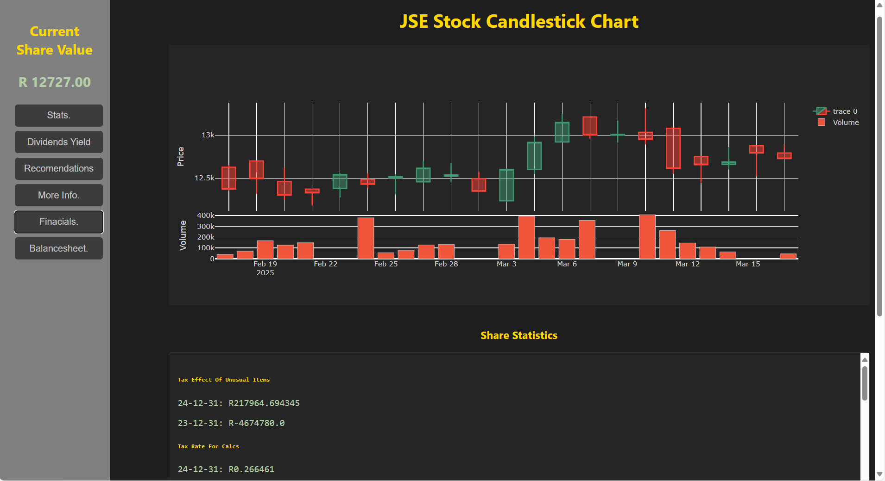

# Market Tracking Dashboard

A web-based dashboard designed to provide insights into stock performance, inspired by the functionality of platforms like Yahoo Finance and Google Analytics. This tool aims to empower users to make more informed investment decisions by presenting key performance indicators and statistical data in an accessible format.

## Features

### Current Capabilities:

*   **Real-Time Stock Data:** Retrieve and display the current share value of a specified stock.
*   **Dividend Yield:** Show the dividend yield for a given stock.
*   **Statistical Information:** Present a range of statistical data related to a single stock, offering a snapshot of its performance.

### Future Goals:

*   **Multi-Stock Tracking:** Expand the capability to allow users to select and monitor multiple stocks simultaneously.
*   **Robust Error Handling:** Implement comprehensive error handling (try-catch blocks) to ensure stability and graceful degradation in case of issues.
*   **AI-Powered Insights:** Integrate AI to provide a summarized, higher-level view of the statistical data, highlighting key trends and insights.

## Getting Started

These instructions will guide you through setting up and running the Market Tracking Dashboard on your local machine.

### Prerequisites

*   **Python 3.x:** Ensure you have Python 3 installed on your system. You can check by running `python3 --version` or `python --version` in your terminal.
*   **Pip:** Pip is the standard package installer for Python. Most Python installations come with pip pre-installed. Check it by running `pip --version` or `pip3 --version` in your terminal.
* **API Key (If applicable):** This project may use an external API (e.g., for fetching stock data). If so ensure you have obtained an API key and that it is set up correctly. Any specific instructions will be stated in the specific step.
*   **Git:** To clone the repository (optional but recommended).

### Installation

1.  **Clone the Repository (Optional):**

    If you want to keep the project files in a version-controlled environment, clone the repository to your local machine:

    ```bash
    git clone <repository_url>
    cd market_tracking_dashboard
    ```
    (replace `<repository_url>` with the actual URL of the repository. This is not provided in the original context, it will be required if you wish to share your code via a repo)

2.  **Install Dependencies:**

    This project likely relies on external Python packages. Navigate to the project directory (where the `requirements.txt` file should be, create one if it does not exist) and install the required packages using pip:

    ```bash
    pip install -r requirements.txt
    ```

    If the `requirements.txt` file does not exist, the packages should be installed one by one.
    ```bash
    pip install pandas yfinance streamlit
    ```
    These are the required packages based on the context of the application

3. **API Key (if required):**
    If there are any API keys required, follow these steps.
    * Obtain an API Key: Sign up with the relevant provider to obtain an API key.
    * Set up Enviroment variable: Some applicaitons may require you to set up an enviroment variable. The instructions from the provider should state this.
    * Include in code: in the code you will have to retreive the variable.
    ```python
    import os

    api_key = os.environ.get('API_KEY')
    ```

### Running the Application

1.  **Navigate to the project directory:**

    ```bash
    cd market_tracking_dashboard
    ```

2.  **Run the application:**

    The specific command to start the application will depend on how it's designed (e.g., a command-line script, a web server). Assuming it uses a common framework like Streamlit, you might run:

    ```bash
    streamlit run main.py
    ```
    (replace `main.py` with the correct script name where the logic is contained)

3. **Accessing the application:**

    Once the above is run, a url will appear in the terminal. Copy that into your browser.

4.  **Using the Dashboard:**

    *   The dashboard should now be accessible in your web browser.
    *   Follow the on-screen instructions to input a stock ticker symbol (e.g., AAPL, MSFT).
    *   View the displayed data, including the current share price, dividend yield, and other relevant statistics.

## Contributing

Contributions to the Market Tracking Dashboard are welcome! If you have ideas for improvements, bug fixes, or new features, please feel free to:

1.  Fork the repository.
2.  Create a new branch for your changes.
3.  Submit a pull request.

## License

license  MIT

# Initial Stage


Initial Phase:

Currently able to pull current share value of stock
Able to display dividence yield,
Able to display other statsistical informnation regarding a single stock.

# Progress:


Target:

To be able to select a multitude of shares,
To have proper try catch safe gaurds
to integrate AI for a more summarative view of the stats.

